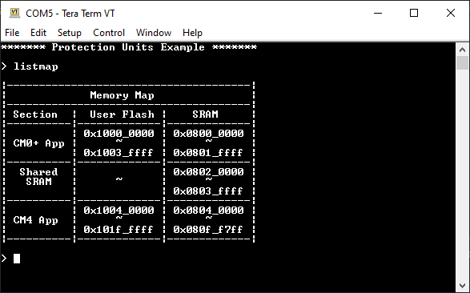
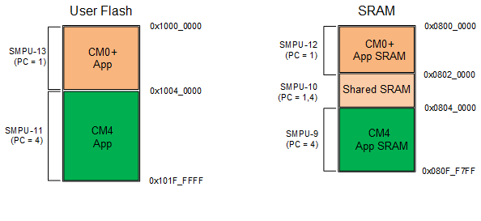

# PSoC&trade; 6 MCU: Protection units

This example demonstrates how to use the protection units to isolate the CM0+ CPU memory from CM4. This example uses FreeRTOS (v10.3.1).

See the "PSoC&trade; 6 MCU dual-CPU development" section in [AN215656](https://www.cypress.com/AN215656) – *PSoC&trade; 6 MCU dual-CPU system design* for instructions on how to develop dual-CPU applications.

[View this README on GitHub.](https://github.com/cypresssemiconductorco/mtb-example-psoc6-dual-cpu-protection-units-freertos)

[Provide feedback on this code example.](https://cypress.co1.qualtrics.com/jfe/form/SV_1NTns53sK2yiljn?Q_EED=eyJVbmlxdWUgRG9jIElkIjoiQ0UyMzIzMjEiLCJTcGVjIE51bWJlciI6IjAwMi0zMjMyMSIsIkRvYyBUaXRsZSI6IlBTb0MmdHJhZGU7IDYgTUNVOiBQcm90ZWN0aW9uIHVuaXRzIiwicmlkIjoicmxvcyIsIkRvYyB2ZXJzaW9uIjoiMS4yLjAiLCJEb2MgTGFuZ3VhZ2UiOiJFbmdsaXNoIiwiRG9jIERpdmlzaW9uIjoiTUNEIiwiRG9jIEJVIjoiSUNXIiwiRG9jIEZhbWlseSI6IlBTT0MifQ==)


## Requirements

- [ModusToolbox&trade; software](https://www.cypress.com/products/modustoolbox-software-environment) v2.2 or later (tested with v2.3)
- Board support package (BSP) minimum required version: 2.0.0
- Programming language: C
- Associated parts: All [PSoC&trade; 6 MCU](https://www.cypress.com/PSoC6) parts with dual CPUs


## Supported toolchains (make variable 'TOOLCHAIN')

- GNU Arm® embedded compiler v9.3.1 (`GCC_ARM`) - Default value of `TOOLCHAIN`
- Arm&reg; compiler v6.13 (`ARM`)
- IAR C/C++ compiler v8.42.2 (`IAR`)

## Supported kits (make variable 'TARGET')

- [PSoC&trade; 6 Wi-Fi Bluetooth&reg; prototyping kit](https://www.cypress.com/CY8CPROTO-062-4343W) (`CY8CPROTO-062-4343W`) - Default value of `TARGET`
- [PSoC&trade; 6 Wi-Fi Bluetooth&reg; pioneer kit](https://www.cypress.com/CY8CKIT-062-WiFi-BT) (`CY8CKIT-062-WIFI-BT`)
- [PSoC&trade; 6 Bluetooth&reg; LE pioneer kit](https://www.cypress.com/CY8CKIT-062-BLE) (`CY8CKIT-062-BLE`)
- [PSoC&trade; 6 Bluetooth&reg; LE prototyping kit](https://www.cypress.com/CY8CPROTO-063-BLE) (`CY8CPROTO-063-BLE`)
- [PSoC&trade; 62S2 Wi-Fi Bluetooth&reg; pioneer kit](https://www.cypress.com/CY8CKIT-062S2-43012) (`CY8CKIT-062S2-43012`)
- [PSoC&trade; 62S1 Wi-Fi Bluetooth&reg; pioneer kit](https://www.cypress.com/CYW9P62S1-43438EVB-01) (`CYW9P62S1-43438EVB-01`)
- [PSoC&trade; 62S1 Wi-Fi Bluetooth&reg; pioneer kit](https://www.cypress.com/CYW9P62S1-43012EVB-01) (`CYW9P62S1-43012EVB-01`)
- [PSoC&trade; 62S3 Wi-Fi Bluetooth&reg; prototyping kit](https://www.cypress.com/CY8CPROTO-062S3-4343W) (`CY8CPROTO-062S3-4343W`)
- Rapid IoT connect developer kit (`CYSBSYSKIT-DEV-01`)
- [PSoC&trade; 62S4 pioneer kit](https://www.cypress.com/CY8CKIT-062S4) (`CY8CKIT-062S4`)

## Hardware setup

This example uses the board's default configuration. See the kit user guide to ensure that the board is configured correctly.

**Note:** The PSoC&trade; 6 Bluetooth&reg; LE pioneer kit (CY8CKIT-062-BLE) and the PSoC&trade; 6 Wi-Fi Bluetooth&reg; pioneer kit (CY8CKIT-062-WIFI-BT) ship with KitProg2 installed. The ModusToolbox&trade; software requires KitProg3. Before using this code example, make sure that the board is upgraded to KitProg3. The tool and instructions are available in the [Firmware Loader](https://github.com/cypresssemiconductorco/Firmware-loader) GitHub repository. If you do not upgrade, you will see an error like "unable to find CMSIS-DAP device" or "KitProg firmware is out of date".

## Software setup

Install a terminal emulator if you don't have one. Instructions in this document use [Tera Term](https://ttssh2.osdn.jp/index.html.en).

This example requires no additional software or tools.

## Using the code example

Create the project and open it using one of the following:

<details><summary><b>In Eclipse IDE for ModusToolbox&trade; software</b></summary>

1. Click the **New Application** link in the **Quick Panel** (or, use **File** > **New** > **ModusToolbox Application**). This launches the [Project Creator](https://www.cypress.com/ModusToolboxProjectCreator) tool.

2. Pick a kit supported by the code example from the list shown in the **Project Creator - Choose Board Support Package (BSP)** dialog.

   When you select a supported kit, the example is reconfigured automatically to work with the kit. To work with a different supported kit later, use the [Library Manager](https://www.cypress.com/ModusToolboxLibraryManager) to choose the BSP for the supported kit. You can use the Library Manager to select or update the BSP and firmware libraries used in this application. To access the Library Manager, click the link from the **Quick Panel**.

   You can also just start the application creation process again and select a different kit.

   If you want to use the application for a kit not listed here, you may need to update the source files. If the kit does not have the required resources, the application may not work.

3. In the **Project Creator - Select Application** dialog, choose the example by enabling the checkbox.

4. Optionally, change the suggested **New Application Name**.

5. The **Application(s) Root Path** defaults to the Eclipse workspace which is usually the desired location for the application. If you want to store the application in a different location, you can change the *Application(s) Root Path* value. Applications that share libraries should be in the same root path.

6. Click **Create** to complete the application creation process.

For more details, see the [Eclipse IDE for ModusToolbox&trade; software user guide](https://www.cypress.com/MTBEclipseIDEUserGuide) (locally available at *{ModusToolbox&trade; software install directory}/ide_{version}/docs/mt_ide_user_guide.pdf*).

</details>

<details><summary><b>In command-line interface (CLI)</b></summary>

ModusToolbox&trade; software provides the Project Creator as both a GUI tool and a command line tool, "project-creator-cli". The CLI tool can be used to create applications from a CLI terminal or from within batch files or shell scripts. This tool is available in the *{ModusToolbox&trade; software install directory}/tools_{version}/project-creator/* directory.

Use a CLI terminal to invoke the "project-creator-cli" tool. On Windows, use the command line "modus-shell" program provided in the ModusToolbox&trade; software installation instead of a standard Windows command-line application. This shell provides access to all ModusToolbox&trade; software tools. You can access it by typing `modus-shell` in the search box in the Windows menu. In Linux and macOS, you can use any terminal application.

The following table lists the arguments for this tool:

Argument | Description | Required/optional
---------|-------------|-----------
`--board-id` | Defined in the `<id>` field of the [BSP](https://github.com/cypresssemiconductorco?q=bsp-manifest&type=&language=&sort=) manifest | Required
`--app-id`   | Defined in the `<id>` field of the [CE](https://github.com/cypresssemiconductorco?q=ce-manifest&type=&language=&sort=) manifest | Required
`--target-dir`| Specify the directory in which the application is to be created if you prefer not to use the default current working directory | Optional
`--user-app-name`| Specify the name of the application if you prefer to have a name other than the example's default name | Optional


The following example will clone the "[Hello World](https://github.com/cypresssemiconductorco/mtb-example-psoc6-hello-world)" application with the desired name "MyHelloWorld" configured for the *CY8CKIT-062-WIFI-BT* BSP into the specified working directory, *C:/mtb_projects*:

   ```
   project-creator-cli --board-id CY8CKIT-062-WIFI-BT --app-id mtb-example-psoc6-hello-world --user-app-name MyHelloWorld --target-dir "C:/mtb_projects"
   ```

**Note:** The project-creator-cli tool uses the `git clone` and `make getlibs` commands to fetch the repository and import the required libraries. For more details, see the "Project creator tools" section of the [ModusToolbox&trade; software user guide](https://www.cypress.com/ModusToolboxUserGuide) (locally available at *{ModusToolbox&trade; software install directory}/docs_{version}/mtb_user_guide.pdf*).

</details>

<details><summary><b>In third-party IDEs</b></summary>

Use one of the following options:

- **Use the standalone [Project Creator](https://www.cypress.com/ModusToolboxProjectCreator) tool:**

   1. Launch Project Creator from the Windows Start menu or from *{ModusToolbox&trade; software install directory}/tools_{version}/project-creator/project-creator.exe*.

   2. In the initial **Choose Board Support Package** screen, select the BSP and click **Next**.

   3. In the **Select Application** screen, select the appropriate IDE from the **Target IDE** drop-down menu.

   4. Click **Create** and follow the instructions printed in the bottom pane to import or open the exported project in the respective IDE.

- **Use command-line interface (CLI):**

   1. Follow the instructions from the **In command-line interface (CLI)** section to create the application, and import the libraries using the `make getlibs` command.

   2. Export the application to a supported IDE using the `make <ide>` command.

   3. Follow the instructions displayed in the terminal to create or import the application as an IDE project.

For a list of supported IDEs and more details, see the "Exporting to IDEs" section of the [ModusToolbox&trade; software user guide](https://www.cypress.com/ModusToolboxUserGuide) (locally available at *{ModusToolbox&trade; software install directory}/docs_{version}/mtb_user_guide.pdf*).

</details>

## Operation

1. Connect the board to your PC using the provided USB cable through the KitProg3 USB connector.

2. Open a terminal program and select the KitProg3 COM port. Set the serial port parameters to 8N1 and 115200 baud.

3. Program the board using one of the following:

   <details><summary><b>Using Eclipse IDE for ModusToolbox&trade; software</b></summary>

      1. Select the application project in the Project Explorer.

      2. In the **Quick Panel**, scroll down, and click **\<Application Name> Program (KitProg3_MiniProg4)**.
   </details>

   <details><summary><b>Using CLI</b></summary>

     From the terminal, execute the `make program` command to build and program the application using the default toolchain to the default target. The default toolchain and target are specified in the application's Makefile but you can override those values manually:
      ```
      make program TARGET=<BSP> TOOLCHAIN=<toolchain>
      ```

      Example:
      ```
      make program TARGET=CY8CPROTO-062-4343W TOOLCHAIN=GCC_ARM
      ```
   </details>

4. After programming, the application starts automatically. Confirm that "Protection Units Example" and other text is displayed on the UART terminal. Type `help` to list supported commands.

5. Type `listmap` to print the memory map.

   **Figure 1. Memory map print**

   

6. Use the commands `read` and/or `write` to access the *Shared SRAM* and *CM4 App* sections. Note that you can read and write to the SRAM and read from the user flash.

7. Use the commands `read` and/or `write` to access the *CM0+ App* sections. Note that a fault occurs.


## Debugging

<mark>*Boilerplate*

You can debug the example to step through the code. In the IDE, use the **\<Application Name> Debug (KitProg3_MiniProg4)** configuration in the **Quick Panel**. For more details, see the "Program and debug" section in the [Eclipse IDE for ModusToolbox&trade; software user guide](https://www.cypress.com/MTBEclipseIDEUserGuide).

**Note:** **(Only while debugging)** On the CM4 CPU, some code in `main()` may execute before the debugger halts at the beginning of `main()`. This means that some code executes twice - once before the debugger stops execution, and again after the debugger resets the program counter to the beginning of `main()`. See [KBA231071](https://community.cypress.com/docs/DOC-21143) to learn about this and for the workaround.


## Design and implementation

In this code example, the flash and SRAM are divided into two main sections: CM0+ app and CM4 app. There is also a shared SRAM section so that data can be shared between the two CPUs.

**Figure 2. Protection unit memory map (2 MB of flash device)**



Each section is protected using the shared memory protection unit (SMPU) with a pre-defined protection context (PC). The following table shows the protection units configured in this example for a PSoC&trade; 6 MCU device with 2 MB of flash.

| Section | Bus master | Memory | SMPU  | Start address | Size | Access attributes | Secure | Protection context  |
| :--- | :--- | :--- | :--- | :--- | :--- | :--- | :--- | :--- |
| CM0+ app | CM0+ | Flash | 13 | 0x1000_0000 | 256 KB | R/W/X | Yes | PC = 1 |
| CM4 app | CM4 | Flash | 11 | 0x1004_0000 | 1792 KB | R/W/X | No | PC = 4 |
| CM0+ SRAM | CM0+ | SRAM | 12 | 0x0800_0000 |  128 KB | R/W | Yes | PC = 1 |
| Shared SRAM | CM0+ / CM4 | SRAM | 10  | 0x0801_0000 | 128 KB |  R/W | No | PC = 1,4 |
| CM4 SRAM | CM4 | SRAM | 9 | 0x0802_0000 | 768 KB | R/W | No | PC = 4 |

<br>

When using other PSoC&trade; 6 MCU devices, the following memory size applies to each section:

| Section | Size |
| ---   | :---|
| CM0+ app | FLASH_SIZE / 8 |
| CM4 app | FLASH_SIZE - FLASH SIZE / 8 |
| CM0+ SRAM | SRAM_SIZE / 8 |
| Shared SRAM | SRAM_SIZE / 8 |
| CM4 SRAM | SRAM_SIZE - SRAM_SIZE / 4 |

<br>

**Note:** If the device has 288 KB of SRAM, use SRAM_SIZE = 256 KB instead.

The CM0+ CPU is responsible to configure all the SMPU and PC. It also configures the bus master to be assigned to a PC. To learn how to configure the SMPU, see [this blog post](https://community.cypress.com/community/product-forums/MCU/psoc-6/blog/2020/12/03/protecting-memory-regions-in-psoc6). Once all the protections units are configured, CM0+ transitions the following bus masters to their respective PC values:

| Bus master | PC |
| ---   | :---|
| CM0+ | 1 |
| CM4 | 4 |
| Test Controller | 1 |

<br>

Once the CM0+ bus master's PC is set to '1', it locks all the protections in place.

The CM4 CPU implements a command console over the UART. The following commands are supported:

Command | Description
--------|-------------
`listmap` | Print the memory map
`read <address>` | Attempt to read the given address
`write <address> <value>` | Attempt to write the given value to the address

<br>

### Folder structure

This application has a different folder structure because it contains the firmware for CM4 and CM0+ applications as shown below:

    |-- cm0p_app/           # Contains CM0+ application
        |-- main.c
        |-- prot_units.c/h
        |-- Makefile
        |-- deps/           # Contains all dependencies for CM0+
    |-- cm4_app/            # Contains CM4 application
        |-- main.c
        |-- command_console # Contains command console library
        |-- console.c/h
        |-- FreeRTOSConfig.h
        |-- Makefile
        |-- deps/           # Contains all dependencies for CM4
    |-- shared/             # Shared folder for CM0+ and CM4
        |-- linker_script/  # Contains linker scripts for the ARM/GCC_ARM/IAR toolchains


### Linker script

When using the default BSP linker script provided by the *TARGET* folder, it allocates only 8192 bytes of RAM and flash for the CM0+ CPU. This example requires more memory for CM0+; therefore, a custom linker script is required, which is located at *shared/linker_script*.

Some new sections are also added to the linker script to reflect the memory map shown in Figure 2.


### Makefiles

The Makefiles for CM0+ and CM4 set the variable `LINKER_SCRIPT` to point to a custom linker script, based on the `TOOLCHAIN` and `TARGET`.

The CM0+ Makefile adds to the variable `DEFINES` the definition of `CY_CORTEX_M4_APPL_ADDR`, which is the CM4 application start address. This address must be manually set based on the location of the CM4 application. The CM0+ application uses this address to launch the CM4 application through the `Cy_SysEnableCM4()` function.

The CM4 application has a folder called *command-console*. The files from this folder comes from this [library](https://github.com/cypresssemiconductorco/command-console). To avoid download unnecessary files, only the files related to the core command console are copied to the *command-console* folder.


### Resources and settings

**Table 1. Application resources**

| Resource  |  Alias/object     |    Purpose     |
| :------- | :------------    | :------------ |
| UART (HAL) | cy_retarget_io_uart_obj | UART HAL object used by Retarget I/O for printing to the console |

<br>

## Related resources

| Application notes                                            |                                                              |
| :----------------------------------------------------------- | :----------------------------------------------------------- |
| [AN228571](https://www.cypress.com/AN228571) – Getting started with PSoC&trade; 6 MCU on ModusToolbox&trade; software | Describes PSoC&trade; 6 MCU devices and how to build your first application with ModusToolbox&trade; software |
| [AN215656](https://www.cypress.com/AN215656) – PSoC&trade; 6 MCU: dual-CPU system design | Describes the dual-CPU architecture in PSoC&trade; 6 MCU, and shows how to build a simple dual-CPU design |
| **Code examples**                                            |                                                              |
| PSoC&trade; 6 MCU examples | [mtb-example-psoc6-*](https://github.com/cypresssemiconductorco?q=mtb-example-psoc6%20NOT%20Deprecated) on GitHub  |
| **Device documentation**                                     |                                                              |
| [PSoC&trade; 6 MCU datasheets](https://www.cypress.com/search/all?f[0]=meta_type%3Atechnical_documents&f[1]=resource_meta_type%3A575&f[2]=field_related_products%3A114026) | [PSoC&trade; 6 technical reference manuals](https://www.cypress.com/search/all/PSoC%206%20Technical%20Reference%20Manual?f[0]=meta_type%3Atechnical_documents&f[1]=resource_meta_type%3A583) |
| **Development kits**                                         | Visit www.cypress.com/microcontrollers-mcus-kits and use the options in the **Select your kit** section to filter kits by *Product family* or *Features*. |
| **Libraries**                                                |                                                              |
| PSoC&trade; 6 peripheral driver library (PDL) and docs  | [mtb-pdl-cat1](https://github.com/cypresssemiconductorco/mtb-pdl-cat1) on GitHub |
| Hardware abstraction layer (HAL) Library and docs    | [mtb-hal-cat1](https://github.com/cypresssemiconductorco/mtb-hal-cat1) on GitHub |
| Retarget-IO - A utility library to retarget the standard input/output (STDIO) messages to a UART port | [retarget-io](https://github.com/cypresssemiconductorco/retarget-io) on GitHub |
| **Middleware**                                               |                                                              |
| CapSense&trade; library and documents                                   | [capsense](https://github.com/cypresssemiconductorco/capsense) on GitHub |
| Links to all PSoC&trade; 6 MCU middleware                           | [psoc6-middleware](https://github.com/cypresssemiconductorco/psoc6-middleware) on GitHub |
| **Tools**                                                    |                                                              |
| [Eclipse IDE for ModusToolbox&trade; software](https://www.cypress.com/modustoolbox) | ModusToolbox&trade; software is a collection of easy-to-use software and tools enabling rapid development with Infineon MCUs, covering applications from embedded sense and control to wireless and cloud-connected systems using AIROC&trade; Wi-Fi and Bluetooth® connectivity devices. |

## Other resources

Cypress provides a wealth of data at www.cypress.com to help you select the right device, and quickly and effectively integrate it into your design.

For PSoC&trade; 6 MCU devices, see [How to design with PSoC&trade; 6 MCU - KBA223067](https://community.cypress.com/docs/DOC-14644) in the Cypress community.

## Document history

Document title: *CE232321* - *PSoC&trade; 6 MCU: Protection units*

| Version | Description of Change |
| ------- | --------------------- |
| 1.0.0   | New code example      |
| 1.1.0   | Added target CYSBSYSKIT-DEV-01 |
| 1.2.0   | Added support for target CY8CKIT-062S4 |
------

All other trademarks or registered trademarks referenced herein are the property of their respective owners.


-------------------------------------------------------------------------------

© Cypress Semiconductor Corporation, 2020-2021. This document is the property of Cypress Semiconductor Corporation, an Infineon Technologies company, and its affiliates ("Cypress").  This document, including any software or firmware included or referenced in this document ("Software"), is owned by Cypress under the intellectual property laws and treaties of the United States and other countries worldwide.  Cypress reserves all rights under such laws and treaties and does not, except as specifically stated in this paragraph, grant any license under its patents, copyrights, trademarks, or other intellectual property rights.  If the Software is not accompanied by a license agreement and you do not otherwise have a written agreement with Cypress governing the use of the Software, then Cypress hereby grants you a personal, non-exclusive, nontransferable license (without the right to sublicense) (1) under its copyright rights in the Software (a) for Software provided in source code form, to modify and reproduce the Software solely for use with Cypress hardware products, only internally within your organization, and (b) to distribute the Software in binary code form externally to end users (either directly or indirectly through resellers and distributors), solely for use on Cypress hardware product units, and (2) under those claims of Cypress’s patents that are infringed by the Software (as provided by Cypress, unmodified) to make, use, distribute, and import the Software solely for use with Cypress hardware products.  Any other use, reproduction, modification, translation, or compilation of the Software is prohibited.
<br>
TO THE EXTENT PERMITTED BY APPLICABLE LAW, CYPRESS MAKES NO WARRANTY OF ANY KIND, EXPRESS OR IMPLIED, WITH REGARD TO THIS DOCUMENT OR ANY SOFTWARE OR ACCOMPANYING HARDWARE, INCLUDING, BUT NOT LIMITED TO, THE IMPLIED WARRANTIES OF MERCHANTABILITY AND FITNESS FOR A PARTICULAR PURPOSE.  No computing device can be absolutely secure.  Therefore, despite security measures implemented in Cypress hardware or software products, Cypress shall have no liability arising out of any security breach, such as unauthorized access to or use of a Cypress product.  CYPRESS DOES NOT REPRESENT, WARRANT, OR GUARANTEE THAT CYPRESS PRODUCTS, OR SYSTEMS CREATED USING CYPRESS PRODUCTS, WILL BE FREE FROM CORRUPTION, ATTACK, VIRUSES, INTERFERENCE, HACKING, DATA LOSS OR THEFT, OR OTHER SECURITY INTRUSION (collectively, "Security Breach").  Cypress disclaims any liability relating to any Security Breach, and you shall and hereby do release Cypress from any claim, damage, or other liability arising from any Security Breach.  In addition, the products described in these materials may contain design defects or errors known as errata which may cause the product to deviate from published specifications.  To the extent permitted by applicable law, Cypress reserves the right to make changes to this document without further notice. Cypress does not assume any liability arising out of the application or use of any product or circuit described in this document.  Any information provided in this document, including any sample design information or programming code, is provided only for reference purposes.  It is the responsibility of the user of this document to properly design, program, and test the functionality and safety of any application made of this information and any resulting product.  "High-Risk Device" means any device or system whose failure could cause personal injury, death, or property damage.  Examples of High-Risk Devices are weapons, nuclear installations, surgical implants, and other medical devices.  "Critical Component" means any component of a High-Risk Device whose failure to perform can be reasonably expected to cause, directly or indirectly, the failure of the High-Risk Device, or to affect its safety or effectiveness.  Cypress is not liable, in whole or in part, and you shall and hereby do release Cypress from any claim, damage, or other liability arising from any use of a Cypress product as a Critical Component in a High-Risk Device.  You shall indemnify and hold Cypress, including its affiliates, and its directors, officers, employees, agents, distributors, and assigns harmless from and against all claims, costs, damages, and expenses, arising out of any claim, including claims for product liability, personal injury or death, or property damage arising from any use of a Cypress product as a Critical Component in a High-Risk Device.  Cypress products are not intended or authorized for use as a Critical Component in any High-Risk Device except to the limited extent that (i) Cypress’s published data sheet for the product explicitly states Cypress has qualified the product for use in a specific High-Risk Device, or (ii) Cypress has given you advance written authorization to use the product as a Critical Component in the specific High-Risk Device and you have signed a separate indemnification agreement.
<br>
Cypress, the Cypress logo, and combinations thereof, WICED, ModusToolBox, PSoC, CapSense, EZ-USB, F-RAM, and Traveo are trademarks or registered trademarks of Cypress or a subsidiary of Cypress in the United States or in other countries.  For a more complete list of Cypress trademarks, visit cypress.com.  Other names and brands may be claimed as property of their respective owners.
